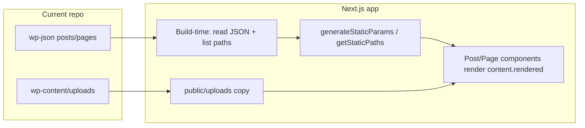

# Next step: static Next.js website

You have already cleaned the repo to Finnish-only content under `[uusikielemme.fi/](uusikielemme.fi/)`, with **wp-json** (658 posts, 22 pages, tags, categories) and **wp-content/uploads** plus **themes/simple-days** still in place. This plan is the next step: a **static Next.js site** that reads that data at build time and outputs plain HTML/CSS/JS.

---

## Data you have

- **Posts:** `[uusikielemme.fi/wp-json/wp/v2/posts/*.json](uusikielemme.fi/wp-json/wp/v2/posts/)` (658 files). Each has:
  - `link` — full URL, e.g. `https://uusikielemme.fi/finnish-vocabulary/random-words/random-words-2-kissa-cat-finnish-vocabulary`
  - `slug`, `title.rendered`, `content.rendered` (HTML), `excerpt.rendered`, `categories`, `tags`, `date`, `modified`
- **Pages:** `[uusikielemme.fi/wp-json/wp/v2/pages/*.json](uusikielemme.fi/wp-json/wp/v2/pages/)` (22 files), same shape (e.g. `link`, `content.rendered`).
- **Taxonomies:** `categories`, `tags` under `wp-json/wp/v2/` for listing/filtering.
- **Media:** `[wp-content/uploads/](uusikielemme.fi/wp-content/uploads/)` — images referenced in `content.rendered` as `https://uusikielemme.fi/wp-content/uploads/...`.

---

## High-level approach

1. Create a **Next.js app** with **static export** (`output: 'export'`).
2. At **build time**, read the local wp-json files (and optionally categories/tags) to get every post/page and its `link` path.
3. Use **dynamic routes** (e.g. `app/[...slug]/page.tsx`) so that paths like `/finnish-vocabulary/random-words/random-words-2-kissa-cat-finnish-vocabulary` are generated from the `link` field.
4. **Render** `content.rendered` (HTML) in the page component (see “Rendering HTML” below).
5. **Copy** `wp-content/uploads` into Next.js `public/uploads` (or `public/wp-content/uploads`) so image URLs resolve.
6. **Normalize image URLs** in content so they point at the static site (e.g. `/uploads/...` or `/wp-content/uploads/...` depending where you put them).

---

## 1. Scaffold Next.js with static export

- Run `npx create-next-app@latest` (e.g. in a new `site` or `web` folder, or at repo root with existing content in a subfolder).
- In **next.config.js** set:
  - `output: 'export'` for a fully static site (no Node server).
- Use the **App Router** (recommended): `app/layout.tsx`, `app/page.tsx`, `app/[...slug]/page.tsx`.

---

## 2. Content loading (build-time)

- **Path to data:** Assume the Next.js app lives next to or above the mirror (e.g. project root is `D:\Dev\uusikielemme` and mirror is `uusikielemme.fi/`). Use a config constant for the path to `uusikielemme.fi` (or `wp-json`).
- **List all post and page paths:**
  - Read `wp-json/wp/v2/posts/*.json` and `wp-json/wp/v2/pages/*.json` (e.g. via `fs.readdirSync` + `require`/`readFileSync`).
  - Parse each JSON and take `link`; strip the origin to get the path (e.g. `/finnish-vocabulary/random-words/...`). That path is the **route** for that post/page.
- **Build a lookup:** Create a map or function that, given a path (or slug array), returns the corresponding post or page object (title, content, excerpt, date, etc.).
- **Home page:** Either use a fixed “home” page from wp-json (e.g. page with id 259 or a known slug) or the first page; alternatively build a simple custom home that links to grammar/vocabulary sections.

---

## 3. Dynamic route for posts and pages

- Use a **catch-all route**: `app/[...slug]/page.tsx`.
- In **generateStaticParams**: Return an array of objects like `{ slug: ['finnish-vocabulary', 'random-words', 'random-words-2-kissa-cat-finnish-vocabulary'] }` for every post and page path (split the pathname into segments). This generates one static HTML file per post/page.
- In the **page** component: get `params.slug`, join to form the path, look up the post or page from your JSON data, then render:
  - `<head>` metadata (title, description from post/page or yoast_head_json).
  - Layout (header, nav, footer).
  - Article body: the HTML from `content.rendered`.

---

## 4. Rendering HTML and image URLs

- **Rendering:** Use `dangerouslySetInnerHTML` with the string from `content.rendered`, or a small sanitizer (e.g. `dompurify` + `isomorphic-dompurify`) to avoid XSS while keeping tables, lists, and inline styles.
- **Image URLs:** In `content.rendered`, replace `https://uusikielemme.fi/wp-content/uploads/` with your static base (e.g. `/wp-content/uploads/` or `/uploads/`) so requests go to `public` in the built site. Do this when you load the JSON or when you pass the string to the component (e.g. in a small helper).

---

## 5. Assets (uploads and optional CSS)

- **Uploads:** Copy the contents of `[uusikielemme.fi/wp-content/uploads](uusikielemme.fi/wp-content/uploads)` into the Next.js **public** directory, e.g. `public/wp-content/uploads`. Then image paths like `/wp-content/uploads/word-kissa-300x177.png` will work in the exported static site.
- **CSS:** Reuse or copy a minimal set of styles from `[wp-content/themes/simple-days/](uusikielemme.fi/wp-content/themes/simple-days/)` (and optionally from `uploads/simple_days_cache/`) into the Next.js app (e.g. `app/globals.css` or a dedicated CSS module) so layout, tables, and typography look correct. You can later replace this with Tailwind or a new design.

---

## 6. Home page and navigation

- **Home:** Implement `app/page.tsx` by loading a specific page from wp-json (e.g. the one whose `link` is `https://uusikielemme.fi/`) or by building a simple React page with links to main sections (e.g. Finnish Grammar, Finnish Vocabulary, Categories) derived from categories in wp-json.
- **Nav:** Add a shared layout in `app/layout.tsx` with a header/nav that links to `/`, `/finnish-grammar`, `/finnish-vocabulary`, and optionally category/tag index pages if you add them later.

---

## 7. Optional: categories and tags

- Load `wp-json/wp/v2/categories` and `wp-json/wp/v2/tags` (if you have list JSON files or can build an index). Then you can add:
  - `app/category/[slug]/page.tsx` and `app/tag/[slug]/page.tsx` with `generateStaticParams` and a listing of posts for that category/tag (filter posts by `categories`/`tags` IDs).

You can defer this and only do posts + pages first.

---

## Suggested order of implementation

1. Create Next.js app with `output: 'export'` and App Router.
2. Add a small **data layer** (e.g. `lib/wp-json.ts`): list all post and page JSON files, parse them, extract paths from `link`, expose `getAllPaths()` and `getByPath(path)`.
3. Implement `app/[...slug]/page.tsx` with `generateStaticParams` (using `getAllPaths`) and page component that uses `getByPath(params.slug)` and renders `content.rendered` with URL rewrite and `dangerouslySetInnerHTML` (or sanitizer).
4. Copy `wp-content/uploads` to `public/wp-content/uploads` and fix image URL rewriting.
5. Implement `app/page.tsx` (home) and `app/layout.tsx` (global layout + nav).
6. Add minimal global CSS from the theme so content looks acceptable.
7. Run `next build` and verify the `out/` static export; optionally add a script to copy `out` into your existing host or deploy to Vercel/Netlify.

---

## Result

You get a **fully static site**: no server, no API at runtime. All content comes from the existing wp-json and uploads. The “next step” is to implement the above in your repo; after that you can refine design, add category/tag index pages, or switch to live WordPress API later if needed.
